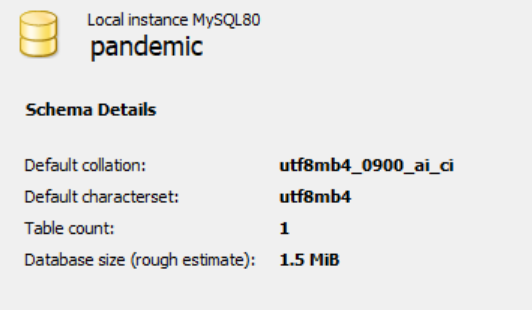
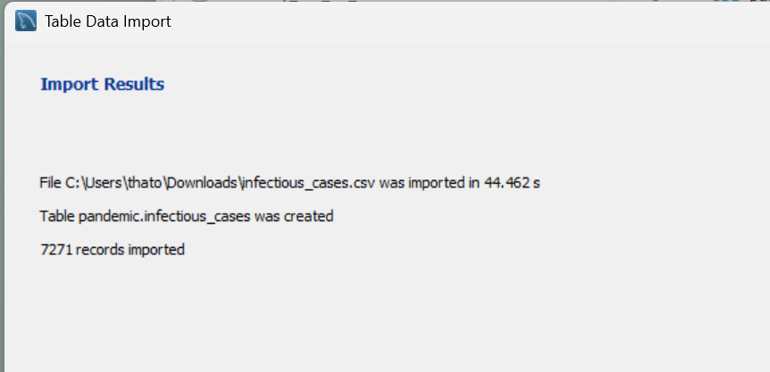
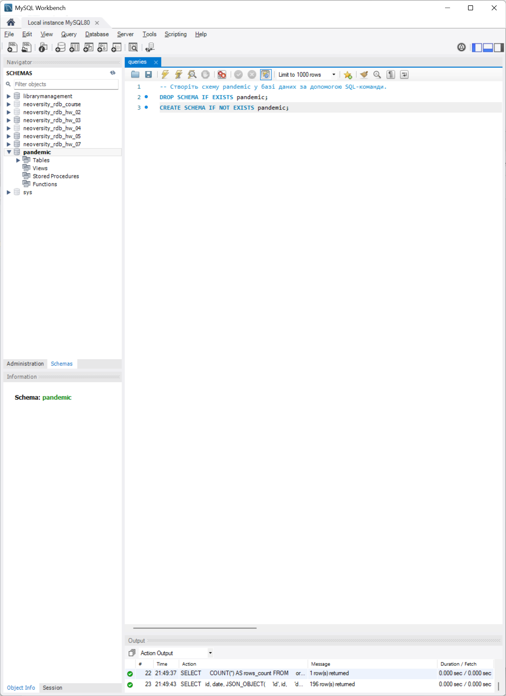
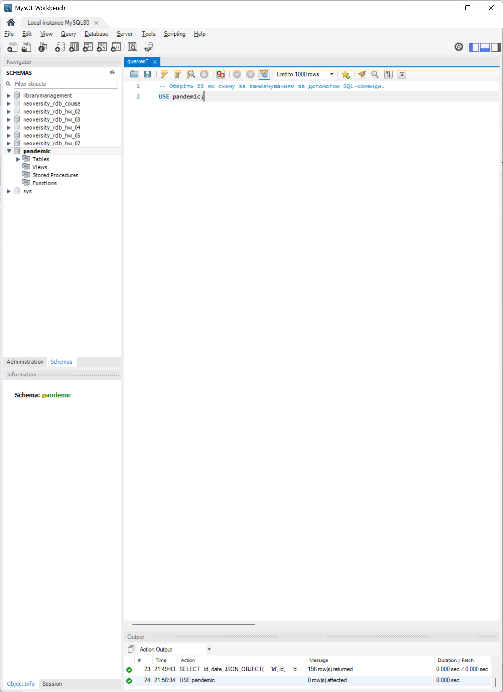
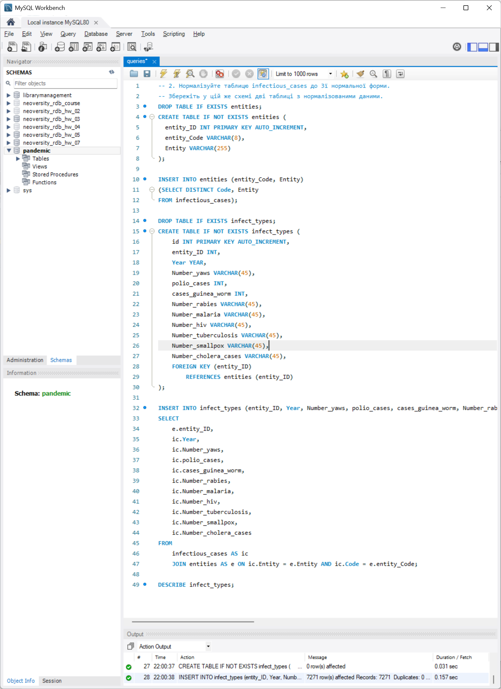
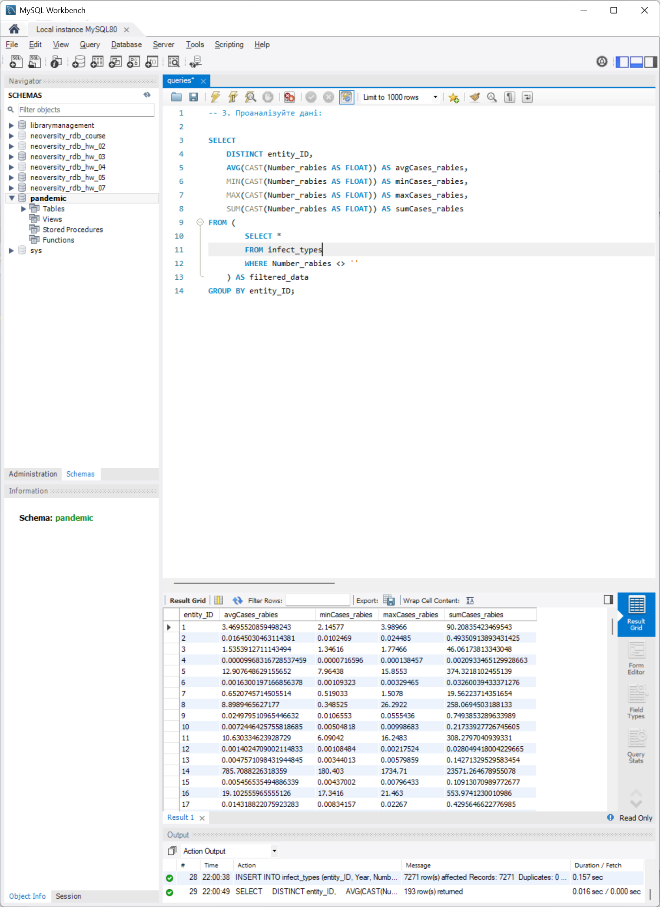
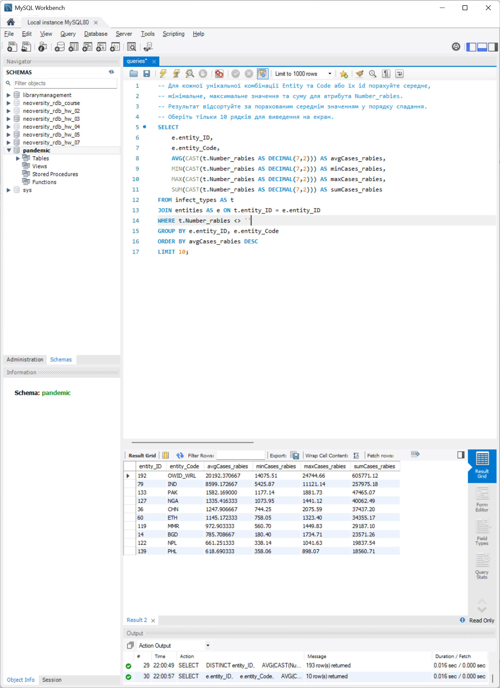
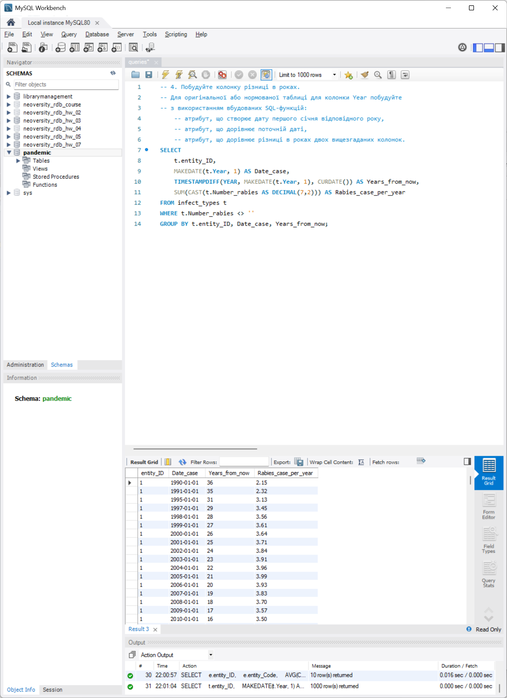
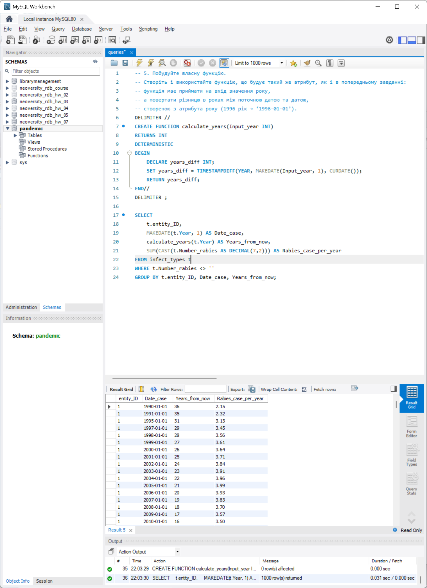
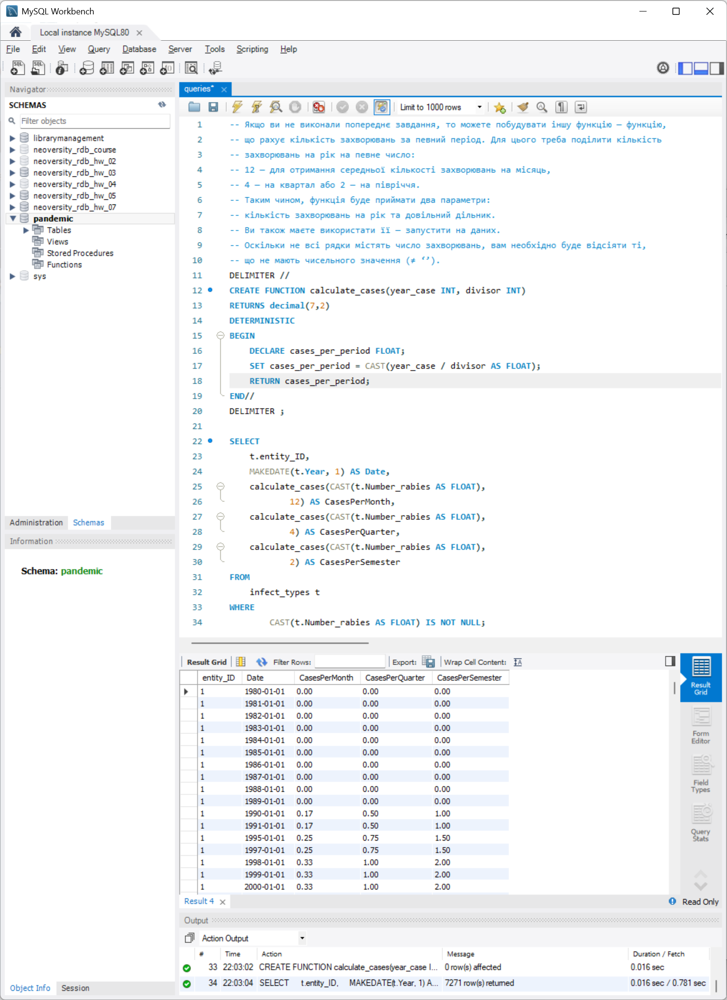

# Фінальний проєкт

Автор: Олександр Попов
Поток: Master of Science: Artificial Intelligence and Machine Learning
Курс: Relational Databases: Concepts and Techniques
Дата: 22/03/2026

## Опис фінального проєкту

1. Завантажте дані:

Створіть схему pandemic у базі даних за допомогою SQL-команди.

Оберіть її як схему за замовчуванням за допомогою SQL-команди.
Імпортуйте дані за допомогою Import wizard так, як ви вже робили це у темі 3.

Продивіться дані, щоб бути у контексті.
💡 Як бачите, атрибути Entity та Code постійно повторюються. Позбудьтеся цього за допомогою нормалізації даних.

2. Нормалізуйте таблицю infectious_cases до 3ї нормальної форми. Збережіть у цій же схемі дві таблиці з нормалізованими даними.

    Виконайте запит SELECT COUNT(*) FROM infectious_cases , щоб ментор міг зрозуміти, скільки записів ви завантажили у базу даних із файла.

3. Проаналізуйте дані:

Для кожної унікальної комбінації Entity та Code або їх id порахуйте середнє, мінімальне, максимальне значення та суму для атрибута Number_rabies.
💡 Врахуйте, що атрибут Number_rabies може містити порожні значення ‘’ — вам попередньо необхідно їх відфільтрувати.

Результат відсортуйте за порахованим середнім значенням у порядку спадання.
Оберіть тільки 10 рядків для виведення на екран.

4. Побудуйте колонку різниці в роках.

Для оригінальної або нормованої таблиці для колонки Year побудуйте з використанням вбудованих SQL-функцій:

    * атрибут, що створює дату першого січня відповідного року,
    💡 Наприклад, якщо атрибут містить значення ’1996’, то значення нового атрибута має бути ‘1996-01-01’.
    * атрибут, що дорівнює поточній даті,
    * атрибут, що дорівнює різниці в роках двох вищезгаданих колонок.
    💡 Перераховувати всі інші атрибути, такі як Number_malaria, не потрібно.
    👉🏼 Для пошуку необхідних вбудованих функцій вам може знадобитися матеріал до теми 7.

5. Побудуйте власну функцію.

Створіть і використайте функцію, що будує такий же атрибут, як і в попередньому завданні: функція має приймати на вхід значення року, а повертати різницю в роках між поточною датою та датою, створеною з атрибута року (1996 рік → ‘1996-01-01’).

💡 Якщо ви не виконали попереднє завдання, то можете побудувати іншу функцію — функцію, що рахує кількість захворювань за певний період. Для цього треба поділити кількість захворювань на рік на певне число: 12 — для отримання середньої кількості захворювань на місяць, 4 — на квартал або 2 — на півріччя. Таким чином, функція буде приймати два параметри: кількість захворювань на рік та довільний дільник. Ви також маєте використати її — запустити на даних. Оскільки не всі рядки містять число захворювань, вам необхідно буде відсіяти ті, що не мають чисельного значення (≠ ‘’).

